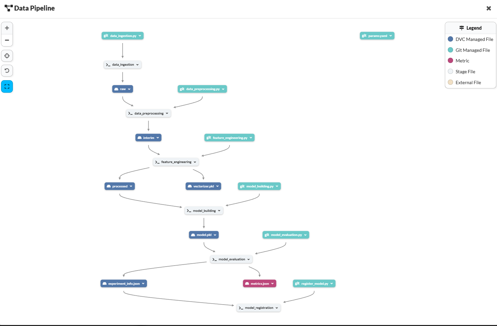
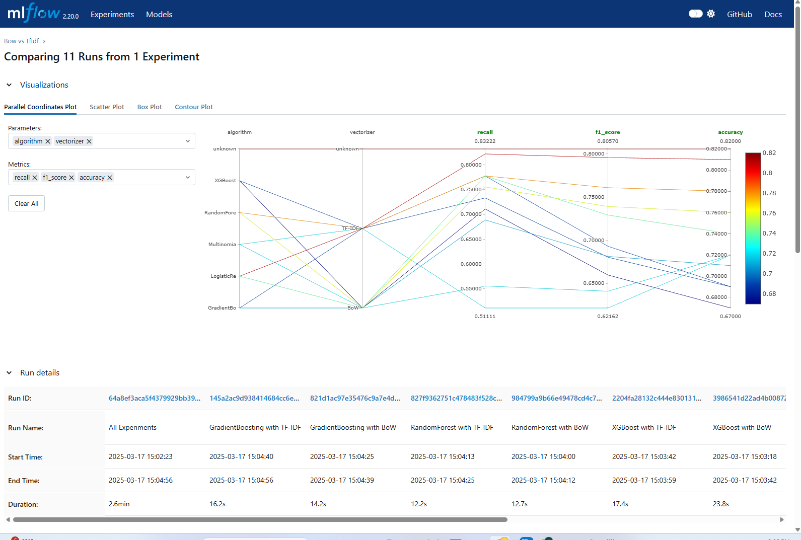
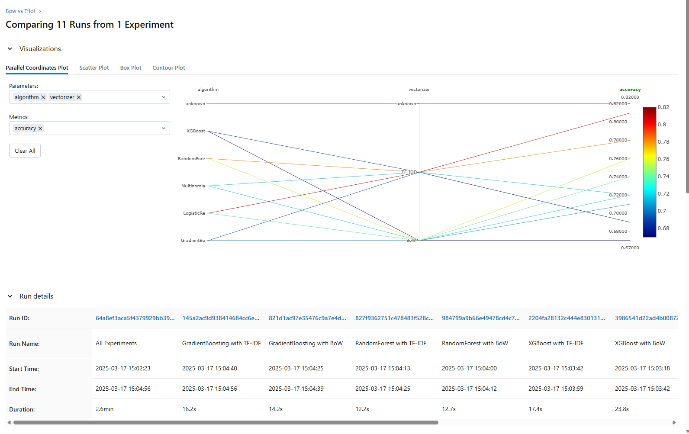
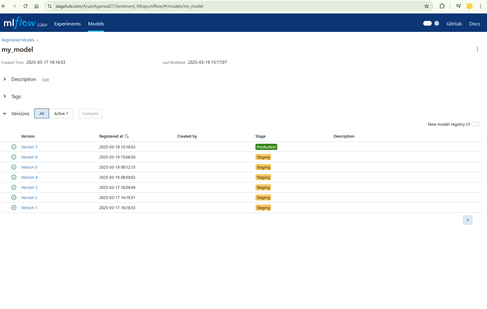
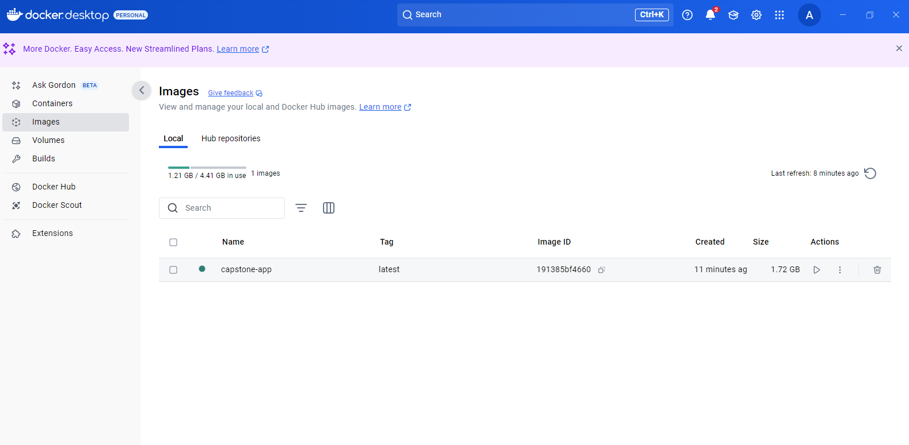
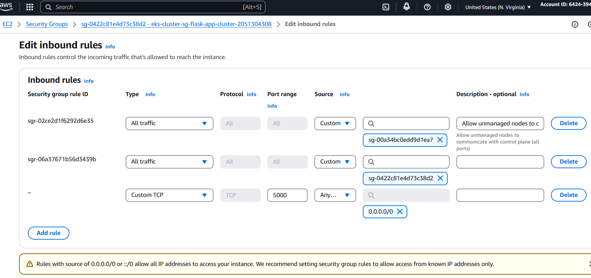
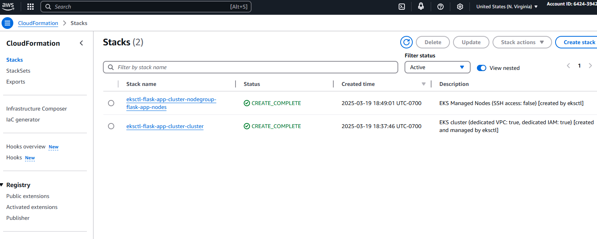
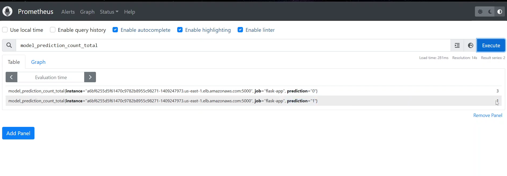
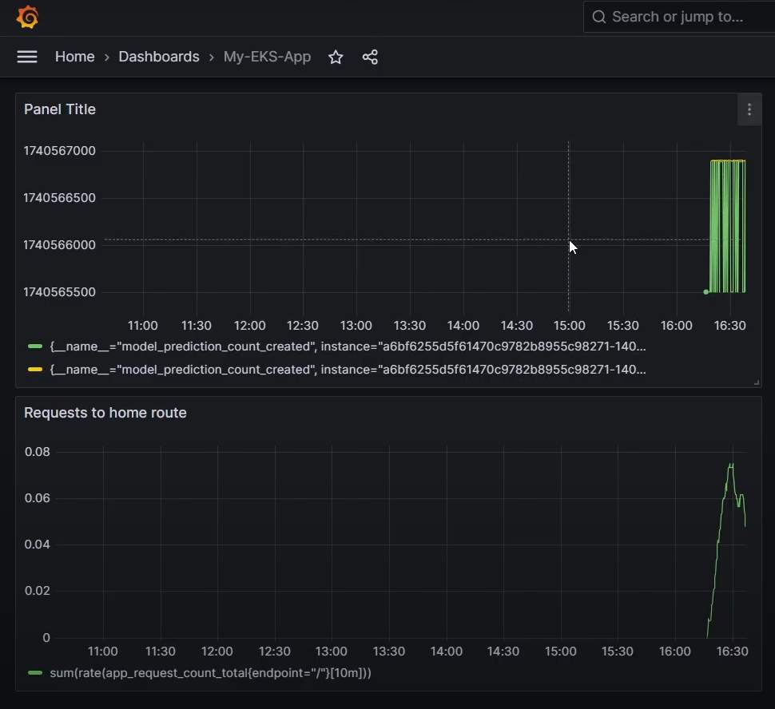
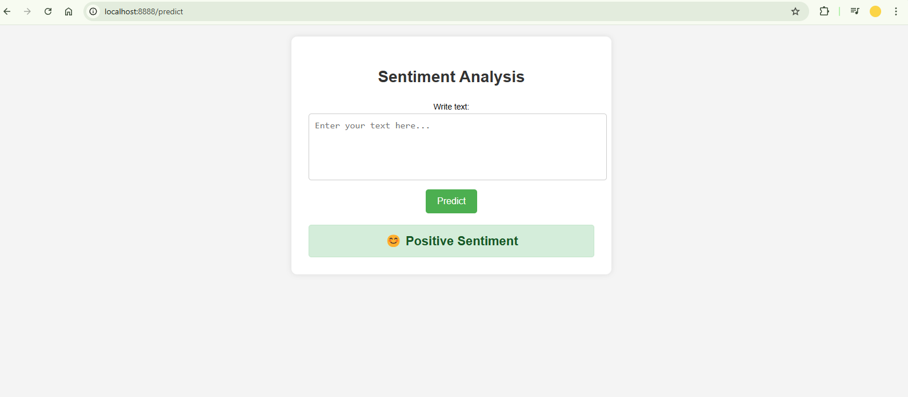

# Sentiment Analysis MLOps Project

## Overview
This project implements a **Sentiment Analysis** pipeline using **MLOps** best practices. It leverages various cloud services, containerization, and automation tools to ensure a scalable and reproducible machine learning workflow.

## Tech Stack
- **Machine Learning**: Scikit-learn, NLTK
- **Data Processing**: Pandas, NumPy
- **Model Management**: MLflow (Dagshub)
- **Version Control**: GitHub
- **Data Version Control** : DVC
- **CI/CD**: GitHub Actions
- **Containerization**: Docker
- **Cloud Deployment**: AWS (EKS, S3, Lambda, API Gateway)
- **Orchestration**: Kubernetes
- **Monitoring**: Prometheus, Grafana

## Project Workflow
1. **Data Ingestion**: Raw data is fetched and processed for training.
2. **Model Training**: A Logistic Regression model is trained using NLP techniques.
3. **Model Tracking**: MLflow is used to log models and experiments.
4. **Containerization**: The trained model is packaged into a Docker container.
5. **CI/CD Pipeline**:
   - Automated testing and validation using GitHub Actions.
   - Docker image built and pushed to Docker Hub.
6. **Deployment**:
   - Kubernetes cluster is used for hosting the API.
   - AWS services (EKS, S3, Lambda, API Gateway) handle scalability.
7. **Monitoring**:
   - Prometheus and Grafana track system and model performance.

## Data Pipeline
This diagram illustrates the data flow from ingestion to model registration, showcasing the various stages involved in processing and training.

## Model Training & Experiment Tracking
Experiments were logged and tracked using MLflow, allowing comparison of different models and hyperparameter tuning.

## Model Registration
Once a model meets performance criteria, it is registered in MLflow and moved to the **Production** stage.

## CI/CD Workflow
Docker images are built and pushed to Docker Hub or AWS ECR as part of the deployment process.

## AWS Infrastructure
### AWS Elastic Container Registry (ECR)
This repository stores Docker container images used for deployment.

### AWS EC2 Security Rules
Security rules are configured to allow traffic to the required ports, ensuring smooth communication between services.

### AWS CloudFormation for Infrastructure Management
CloudFormation templates automate the provisioning of AWS infrastructure for the project.

## Monitoring
### Prometheus Metrics
Prometheus is used to track model prediction counts, API usage, and other key performance metrics.

### Grafana Visualization
Grafana is used to visualize the performance metrics collected by Prometheus, enabling real-time monitoring.

## Deployed Application
The Flask application is deployed on an **AWS EKS Cluster** and serves sentiment analysis predictions via an API endpoint.

## How It Works
1. The model is trained locally and logged using MLflow.
2. The trained model is containerized and pushed to Docker Hub.
3. CI/CD pipeline ensures continuous integration and deployment.
4. The API is deployed on AWS EKS and exposed via AWS API Gateway.
5. Monitoring is done using Prometheus and Grafana dashboards.

## Conclusion
This project demonstrates a robust **MLOps pipeline** for **sentiment analysis**, integrating model development, deployment, and monitoring using modern cloud-based solutions.
